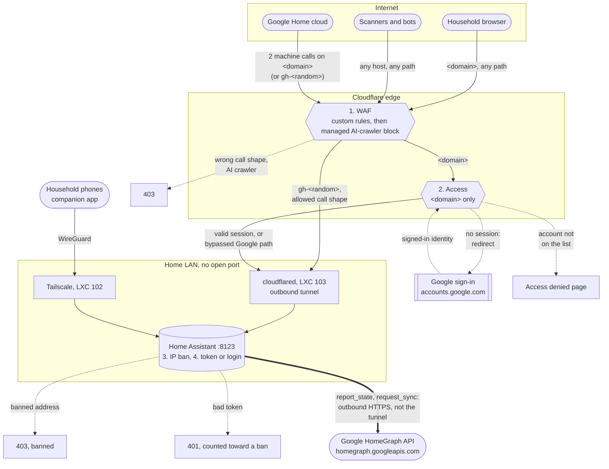
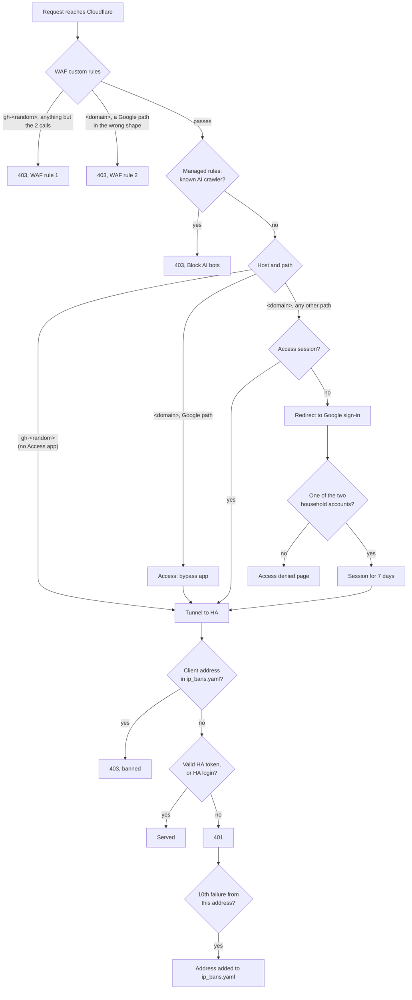

# Remote-access security

How Home Assistant is reachable from the internet, and how each request is
accepted or denied on the way in. The only public caller that must reach HA
without a person in front of it is Google Home (and Gemini through it);
everything else that arrives from the internet has to pass a Google login first.

The real domain and the random label of the Google-only hostname are not
written here: the repo is public, and the label is worth something only while
it is unpublished. They are called `<domain>` and `gh-<random>.<domain>` below.

## Traffic flow

Solid arrows are requests that get through, dotted arrows are redirects and
denials, and the thick arrow is HA's own outbound traffic. The numbers are the
order the checks run in. `cloudflared` holds an **outbound** tunnel to Cloudflare, so the router
has no open port and Cloudflare is the only way in from the internet. The
Google sign-in is a browser redirect: Cloudflare never forwards anything to
Google, and nothing reaches the tunnel until Access has a session. The
household's phones don't use the tunnel; the companion app connects over
[Tailscale](../../Proxmox/docs/102-tailscale.md).

## Public hostnames

| Hostname | For | Reaches HA when |
| --- | --- | --- |
| `<domain>` | people in a browser, and (today) Google | a household member has an Access session, **or** the request is one of Google's two machine calls in the right shape |
| `gh-<random>.<domain>` | Google only | the request is one of Google's two machine calls in the right shape. There is no Access app here: the WAF rule is the only gate |

Both route through the tunnel to the same HA. No other hostname has a DNS
record; the tunnel's catch-all answers 404 for anything else routed to it.

## How a request is decided

Cloudflare runs the WAF custom rules, then its managed rules, then Access
(verified: a path blocked by a custom rule answers 403, not the Access
redirect). HA then checks the ban list before it looks at the token.

The two Google calls, as the custom rules define them: `POST /api/google_assistant`
with an `Authorization` header starting `Bearer `, and `POST /auth/token`. The
"Google paths" on `<domain>` are those two paths with any method.

### Accepted

| Request | Path through the layers |
| --- | --- |
| Voice command, Google Home app refresh (SYNC, QUERY, EXECUTE) | `POST /api/google_assistant` with the HA access token Google holds → WAF allows the shape → Access bypass (on `<domain>`) → HA checks the token → answers |
| Google refreshing its token (whenever its 30-minute HA access token has expired) | `POST /auth/token` with the refresh token → WAF allows → Access bypass → HA issues a new access token |
| Household member opens the UI | redirect to Google sign-in → the account is one of the two allowed → 7-day Access session → HA's own login page |
| Account linking in the Google Home app | the phone's browser opens `/auth/authorize` on `<domain>` → Google sign-in (Access) → HA login → HA redirects back to Google with a code → Google redeems it with `POST /auth/token` |

### Denied

| Request | Stopped by | Answer |
| --- | --- | --- |
| Anything on `gh-<random>` other than the two calls: the UI, `/api/*`, any `GET`, probes | WAF rule 1 | 403; HA never sees it |
| `GET` or any other method, or no `Bearer` header, on the two Google paths of `<domain>` | WAF rule 2 | 403 |
| Known AI crawlers that passed the custom rules, any host | Cloudflare *Block AI bots* (managed rules) | 403 |
| Any other path on `<domain>` without a session: the UI, `/api/config`, `.env` and path-traversal probes | Access | redirect to the Google sign-in |
| Signing in with a Google account that is not on the list | Access | "access denied" page |
| A request from an address HA has banned | HA IP ban | 403, before any login check |
| A well-shaped Google call with a forged or expired token | HA | 401, counted against the client address; the 10th failure bans it |

Because `cloudflared` is HA's only trusted proxy (`trusted_proxies`, plus the
Supervisor network and localhost for add-ons), HA takes the client address from
`X-Forwarded-For` and bans the **real client**, never the tunnel. A LAN device
can't forge that header, because it isn't a trusted proxy. The Supervisor's own
address is never banned.

## Configuration

| Where | Setting |
| --- | --- |
| Zero Trust → Networks → Tunnels → *Proxmox* | public hostnames `<domain>` and `gh-<random>.<domain>` → `http://<ha>:8123`; catch-all `http_status:404` |
| Zero Trust → Access → Applications → **Home Assistant UI** | destination `<domain>`; policy *Household (Google login)*: include the two household emails, require login method Google; session 7 days; straight to Google, no app launcher |
| Zero Trust → Access → Applications → **HA - Google Home endpoints (bypass)** | destinations `<domain>/api/google_assistant`, `<domain>/auth/token`; policy *Google Home machine calls (bypass)* |
| Zero Trust → Integrations → Identity providers → **Google** | OAuth client *Cloudflare Access* in the Google Cloud project that also holds the Google Assistant service account; consent screen External, In production |
| Zone → Security → WAF → Custom rules | rule 1 (Google-only host) and rule 2 (Google paths on `<domain>`), both *Block* unless `POST /api/google_assistant` with an `Authorization` header starting `Bearer `, or `POST /auth/token` |
| HA → Settings → System → Network | `use_x_forwarded_for`, `trusted_proxies`: LXC 103's address, `172.30.32.0/23`, `127.0.0.1`; `ip_ban_enabled`; `login_attempts_threshold: 10` |
| Google Home Developer Console | Authorization URL, Token URL and Fulfillment URL, all on `<domain>` today |

The HA HTTP settings are **not** in `configuration.yaml`. Since 2026.x the
`http:` block is migrated once into `.storage/http` and ignored afterwards (a
repair says so, and YAML support ends in 2027.2), so don't add one back. Without
the UI they can be changed over the websocket API: `http/config` reads them,
`http/config/configure` stores a new *pending* config and restarts, and
`http/config/promote` confirms it. **A pending config that isn't promoted within
5 minutes reverts by itself**, so a proxy mistake that locks HA out undoes
itself.

## Operating it

- **Google voice control stops working:** look in `/config/ip_bans.yaml` first
  (a Google address banned after failed refreshes), then Cloudflare → Security
  → Events for blocks on the two Google paths.
- **New household member:** add their Google address to *Household (Google
  login)*; their phone uses Tailscale.
- **Don't turn on Bot Fight Mode or a zone-wide challenge:** on the free plan it
  also hits Google's calls, which cannot solve a challenge.
- **Every HA user** keeps multi-factor login; administrator only where needed;
  unused long-lived tokens revoked (Profile → Security).

## Next step

Google still calls `<domain>`. Moving its Token URL and Fulfillment URL to
`gh-<random>.<domain>` (the Authorization URL stays on `<domain>`, behind the
login) would let the bypass app and WAF rule 2 go, leaving `<domain>` with no
path that skips the Google login.
