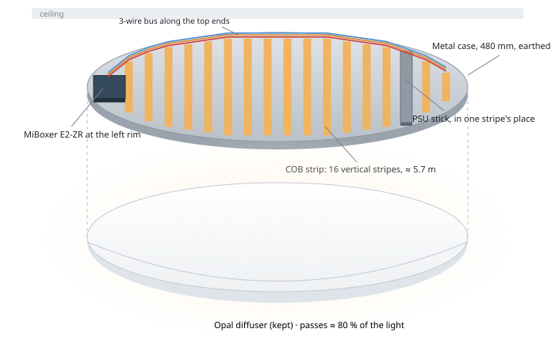
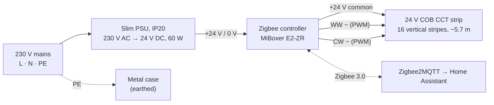
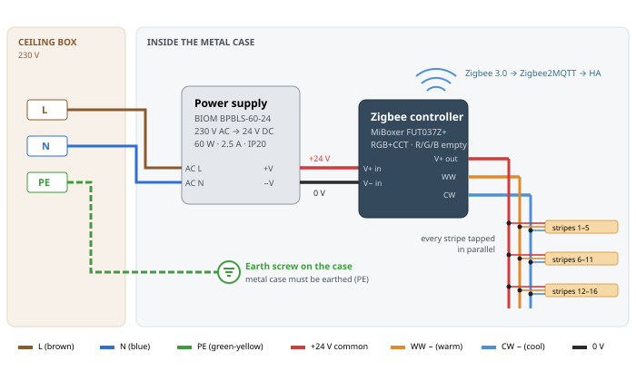
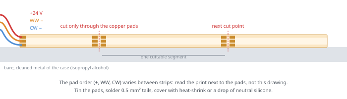
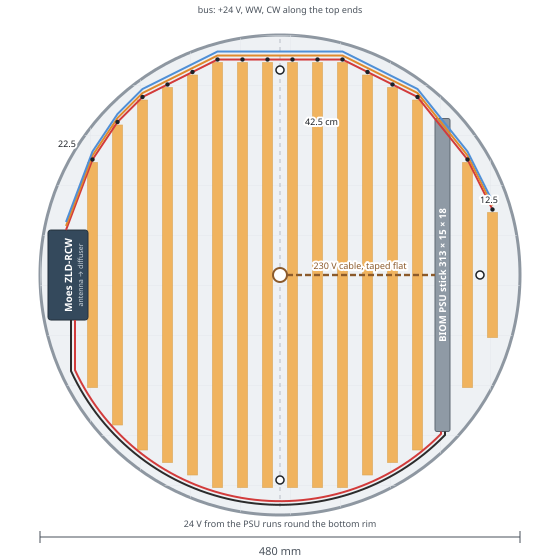
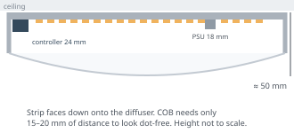

# LedLamp — rebuilding a Chinese ceiling lamp as a Zigbee tunable-white light

Keep the lamp's **metal case** and diffuser; replace everything inside with:

1. **COB LED strip, tunable white (CCT)**: warm 2700 K to cool 6500 K, dot-free under the diffuser.
2. **Zigbee CCT controller**: paired with the house's Zigbee2MQTT, so HA gets brightness + colour temperature.
3. **Slim 24 V power supply**.

**Constraints:** living room (IP20 parts are fine, nothing sealed needed), **Zigbee only**, **≤ 2500 UAH** in total,
and as bright as possible within that.

**The lamp:** Luxel **CLRR-72**, a round remote-controlled fitting, **480 mm across** (measured) and about 50 mm deep.
Its label says **72 W, 175–260 V, 5400 lm**.

**What's inside now** (from a photo of the opened lamp): two square LED boards, about 33 cm and 24 cm across, carrying
roughly **75 separate LEDs under small lenses**, about 2.3 m of board in total. A small mains driver in a clear plastic
box and a 3-way terminal block (L, N, earth) sit in the middle, and the base is painted white metal. There are mounting
holes near the rim at the top, bottom and right. The separate lensed LEDs are why the old light looks spotty.

Prices and stock were checked on **2026-09-26** and change often, especially on prom.ua. Rozetka refused automated
lookups (HTTP 403). A printable version with drawings, [`LedLamp.pdf`](LedLamp.pdf), is built from this README
and [`docs/`](docs) by `tools/build_pdf.py`.

---

## 1. Parts to buy: ≈ 3200 UAH for the lamp, ≈ 825 for the wall switch

| # | Part | Pick | Shop | Price, UAH |
|---|---|---|---|---|
| 1 | CCT COB strip, **7 m** (5.7 m used, 1.3 m spare) | **LEDTech 24V COB/FCOB CCT 2700–6500K Multi White**: 14 W/m (7+7), 1400 lm/m, 608 LED/m, Ra>90, **10 mm** wide | [prom.ua (LEDTechnics)](https://prom.ua/ua/p2655960753-svetodiodnaya-lenta-ledtech.html) | ~1578 (225.40/m × 7 m) |
| 2 | Zigbee controller | **MiBoxer (Mi-Light) E2-ZR** W+CCT 2-in-1: Zigbee 3.0 + 2.4G RF, DC 12–24 V, 12 A, **100.6×40×17.6 mm**, PWM 250 Hz / 16 kHz | [prom.ua (OPTSVET)](https://prom.ua/ua/p2560711030-kontroller-light-tunable.html) | 1210 |
| 3 | Power supply | **BIOM Professional STICK BPBLS-60-24**: 24 V / 2.5 A, **313×15×18 mm**, IP20, metal case, 176–265 V in | [samsnab](https://samsnab.com.ua/uk/osveshchenie/bloki-pitaniya-dlya-led/14837-blok-pitaniya-biom-professional-dc24-60w-bpbls-60-24-2-5a-stick) (order via Viber) · [biom.ua, 358](https://biom.ua/blok-pitaniya-biom-professional-dc24-60w-bpbls-60-24-2.5a-stick/) | 315 |
| 4 | Wire (0.75 + 0.5 mm²), heat-shrink, 3 Wago 221 | local | — | ~100 |
| | **Total (lamp)** | | | **≈ 3203** |

**Ask the strip seller for 7 m.** The layout uses about 5.7 m; the rest covers cutting mistakes and a spare stripe for
repairs. The listing is priced per metre; if they only sell whole 5 m reels, two reels (10 m) cost ~2254 and the total
rises to ≈ 3880. The spare strip, the better power supply and the E2-ZR put the lamp about 700 over the original
2500 budget; the wall switch ([`docs/wall-switch.md`](docs/wall-switch.md)) adds ≈ 825. The [LT COB-24-MW-608 at svetum](https://svetum.com.ua/ua/catalog/svetodiodnaya-lenta/led-lenta-lt-cob-608sht-m-7-7w-m-24v-ip20-2700-6500k-multi-white-10mm-cob-24-mw-608-91106/)
(same 7+7 W/m, CRI 90, 10 mm) is sold only in 5 m steps.

**Why these:**
- **Strip:** the only one found that meets every point (2700–6500 K, Ra>90, 10 mm, 14 W/m) at the lowest price. Light
  per metre decides the brightness, so stay at 14 W/m: 10 W/m strips give about a third less.
- **Controller:** a survey of Zigbee CCT controllers found nothing meaningfully better. The E2-ZR is purpose-built
  for tunable white, has the highest PWM found (**16 kHz**, no flicker on camera), pairs directly with MiBoxer 2.4G RF
  remotes (they work even if HA is down), works as a Zigbee router, and is in stock in Ukraine. Zigbee2MQTT supports
  it ([E2-ZR](https://www.zigbee2mqtt.io/devices/E2-ZR.html): brightness, color_temp 153–500 mired, `do_not_disturb`); some units pair as the generic
  `TS0502B` with the same controls. No OTA updates through Z2M.
- **Power supply:** the only mains part, sitting in a closed metal lamp, so it is the one worth paying a little more
  for. BIOM is an established Ukrainian LED brand with a local warranty, and the stick is thin enough (15 mm) to sit
  between two stripes. 5.7 m of strip draws ~40 W (1.7 A), so the 60 W unit runs at about two-thirds load. It is out
  of stock at most shops: samsnab takes orders by Viber inquiry, and biom.ua lists it at 358.

**Swaps if something is out of stock:**
- Power supply: [LED STORY Profi 60W slim](https://led-story.ua/blok-24v-zhivlennja-led-strichok-60w-25a-tonkij-korpus-ip20-led-story-profi/), 297×17×17 mm, IP20, 218 (on sale), in stock.
  A shop house brand with no efficiency, ripple or safety figures, so only if the BIOM can't be had.
- Controller: the **Moes ZLD-RCW** ([SELLBOT, 849](https://prom.ua/ua/p2985124892-kontroler-svitlodiodnih-strichok.html), [Z2M](https://www.zigbee2mqtt.io/devices/ZLD-RCW_1.html)),
  a Tuya RGB+CCT unit with R, G and B left unused. Cheaper (lamp ≈ 2842), but its PWM is unpublished, batches vary,
  and it has no direct remote.

---

## 2. How it fits together

### Wiring

- **The strip is common-anode**: one `+24 V` pad and two negative pads (`WW`, `CW`). The controller switches the
  negatives. Follow the controller's label for which outputs are V+ and the two whites, and set it to CCT (dual white) mode.
- **Earth the case.** The PSU sits on mains inside a metal case; connect PE to the case's earth screw. The 24 V side is
  then touch-safe.
- **Wire gauge**: mains and PSU → controller 0.75 mm²; the 3-wire bus 0.5–0.75 mm² (1.7 A in total); tails to each
  stripe 0.5 mm² / 20–22 AWG.
- **Solder the strip.** Clip-on connectors are unreliable on COB strip; tin the pads and solder the three wires.

### Layout in the 480 mm case: 16 vertical stripes

- **16 vertical stripes, 10 mm wide with 15 mm gaps** (25 mm centre to centre), ending about 15 mm from the wall. The
  full pattern is 18 stripes; the PSU stick takes one stripe's place (at x = +16 cm, where the case is still 339 mm
  tall) and the controller takes the outermost stripe on the left. The E2-ZR (100.6 × 40 mm) is a tight fit
  there: about 2–3 mm to the wall and 0.5 mm to the next stripe on paper. If your case is smaller inside, drop the
  22.5 cm stripe next to it (≈ 5.45 m in total). Each stripe is cut at the nearest pads, so the
  lengths are 42.5 cm in the middle down to 12.5 cm at the right edge: **≈ 5.7 m in total**.
- **Keep the centre line clear**: the stripes sit at ±12.5, ±37.5 … mm, so a 15 mm gap runs down the middle. The top
  and bottom mounting holes fall in that gap, and the right-hand hole falls in the gap between the last two stripes.
  Check the holes on your case before sticking anything.
- **Feed each stripe from its top end**: a 3-wire bus (+, WW, CW) runs from the controller up the left rim and along
  the stripes' top ends, with a short tail down to each one. The longest stripe is 42.5 cm, so one feed per stripe
  keeps the brightness even. Do not daisy-chain all 16 end to end.
- **The old terminal block has to go**: it doesn't fit between two stripes. The mains cable comes through the centre
  hole; tape it flat across the stripes to the PSU and join it with Wago 221 connectors there.
- **Heat is not a problem.** A Zigbee CCT controller keeps warm + cool at 100 % in total, so each stripe draws at most
  7 W/m: about 40 W over the whole base, ~220 W/m². Expect about 40–50 °C on the strip in a 25 °C room (an estimate;
  the limit is 75 °C). Strip makers only ask for aluminium above ~10 W/m, so stick it straight onto the cleaned,
  painted steel. A 15 mm gap is plenty; at 7 W/m even 10 mm would be safe, but narrower gaps don't add light because
  the length is capped by the case.
- **Zigbee through metal is weak.** Mount the controller with the antenna end toward the diffuser. It is mains-powered,
  so it also works as a **Zigbee router**. Its PWM frequency (250 Hz or 16 kHz) is switched with a MiBoxer RF remote;
  16 kHz rules out flicker on phone cameras.
- COB strip needs little distance to the diffuser: 15–20 mm already looks dot-free.

---

## 3. Build checklist

1. **Before the rebuild**, take lux-meter readings under the old lamp at warm, neutral and cool (see [`docs/brightness.md`](docs/brightness.md)).
2. Measure the free height inside and how the diffuser attaches.
3. Remove the two old LED boards, the driver and the centre terminal block. Clean the painted base where the strip will
   go (isopropyl alcohol).
4. Mark the centre line, then stripe centres every 25 mm from x = ±12.5 mm outward, the mounting holes, the PSU slot at
   x ≈ +16 cm and the controller slot at the left rim.
5. Cut each stripe at the nearest pads so it ends ~15 mm from the wall, stick them on, and insulate every solder joint
   (heat-shrink or Kapton tape) so no pad touches the metal.
6. Mount the PSU and controller in their slots (thermal tape or screws). Run the 3-wire bus up the left rim and along the
   stripes' top ends, and solder a tail to each stripe. Earth the case, and join the mains cable at the PSU with Wago 221.
7. Bench test first on 24 V: both channels light, correct warm/cool order (swap WW/CW if reversed). At full brightness
   at neutral white the 24 V side should draw about 1.7 A.
8. Pair with Zigbee2MQTT (permit join, then follow the device's pairing method on its z2m page). Check that
   `brightness` and `color_temp` both work from HA. Set **`do_not_disturb` on**, so the lamp stays off when power
   returns after an outage instead of lighting up in the night. If you have a MiBoxer RF remote, switch PWM to 16 kHz.
9. Close the diffuser, run at full power for an hour, and check the strip is comfortably warm, not hot (under ~60 °C).
10. Repeat the lux-meter readings and compare.
11. Fit the wall switch and its automation ([`docs/wall-switch.md`](docs/wall-switch.md)).

---

## Tools

| Script | Does |
| --- | --- |
| `tools/build_pdf.py` | builds `LedLamp.pdf` from this README and `docs/*.md` with headless Chrome (needs `pip install -r tools/requirements.txt`) |

## Docs

| Doc | About |
| --- | --- |
| [`docs/brightness.md`](docs/brightness.md) | how bright the rebuild will be, against the old lamp, and the numbers behind it |
| [`docs/parts-candidates.md`](docs/parts-candidates.md) | every strip, controller and power supply found, with prices and links |
| [`docs/option-b-mains-driver.md`](docs/option-b-mains-driver.md) | the fewer-parts option (a mains Zigbee driver) and why it was not chosen |
| [`docs/wall-switch.md`](docs/wall-switch.md) | the wireless rocker switch fixed into the old wall box, and its automation |
