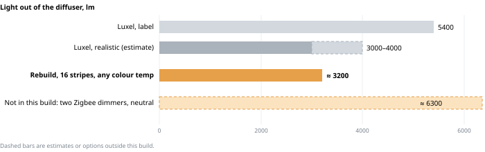
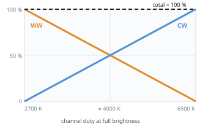

# How bright will it be?

**About 3200 lm out of the diffuser at any colour temperature, from about 48 W at the wall.**

How the numbers are worked out:

- **Strip:** 1400 lm/m at 14 W/m, but that is **both** channels at 100 %. A Zigbee colour-temperature controller mixes
  the two whites so they add up to 100 %: at 2700 K only WW is on, at 6500 K only CW, in between both share. So the
  usable maximum is **one channel's worth: 700 lm/m at 7 W/m**. No Zigbee CCT controller found can change this:
  MiBoxer confirms the E2-ZR [keeps 50 % + 50 % at neutral and "it can not be changed"](https://forum.miboxer.com/t/fut035z-setting-both-channels-to-100-in-dual-white-color-mode/249).
- **Diffuser:** an opal cover passes about 80 %.
- **Power supply + controller:** about 85 % × 98 % efficient.

| | LED power | From the wall | Light out of the diffuser |
|---|---|---|---|
| **Rebuild, 16 stripes ≈ 5.7 m, any colour temperature** | **40 W** | **48 W** | **≈ 3200 lm** |
| Luxel, label | — | 72 W | 5400 lm |
| Luxel, realistic guess | — | ~45–55 W | ~3000–4000 lm |

**The Luxel's real output:** a "72 W" Chinese fitting usually draws 45–55 W, and at 70–75 lm per wall-watt that is
**3000–4000 lm** with both colour channels on (neutral). That is a rough estimate, not a measurement. Against it the
rebuild is **about the same to 20 % dimmer at neutral**, and probably brighter at the warm and cool ends, where the
Luxel likely uses only half its LEDs. For an 18–20 m² living room, ~3000 lm is comfortable general light.

**The one Zigbee route to more light at neutral:** two single-channel Zigbee dimmers (e.g. 2× MiBoxer E2-ZR in
single-colour mode, one per white) mixed by an HA template light, so both whites can run at 100 %. That gives up to
~6300 lm at neutral from ~80 W, but needs a second E2-ZR (+1210), a 100 W supply, and at 14 W/m the strip
wants aluminium under it. Not part of this build.

**Measure instead of guessing:** put a phone lux-meter app on the floor under the lamp, and write down the old lamp's
readings at warm, neutral and cool. Repeat after the rebuild at the same spot.

---
