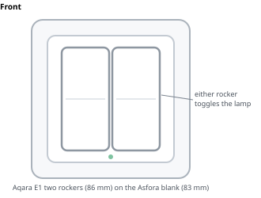
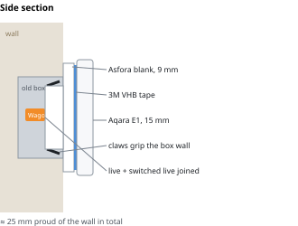

# Wall switch: classic rockers, for an elderly family member

The lamp's controller must stay powered, so the old mechanical switch goes: its two wires are joined permanently and a
**battery Zigbee switch that looks like an ordinary two-key rocker switch** takes its place, **fixed into the old 60 mm box**.

## Parts: ≈ 820 UAH

| Part | Pick | Shop | Price, UAH |
|---|---|---|---|
| Switch | **Aqara Wireless Remote Switch E1, two rockers** (WXKG17LM): two rockers on an 86×86×15 mm plate, CR2032, Zigbee 3.0 | [SELLBOT on prom.ua](https://prom.ua/p1506130852-bezdrotovij-vimikach-klavishi.html), ready to ship (single-rocker WXKG16LM: 600 at [sellbot](https://sellbot.com.ua/ua/p1506121949-bezdrotovij-vimikach-klavishi.html)) | 650 |
| Box adapter | **Schneider Asfora blank EPH5600121**, white, 83×83 mm, **fixes into the box with spreading claws** | [prom.ua (Електро Крамниця)](https://prom.ua/ua/p1254302585-zaglushka-asfora-schneider.html) · [schneider.kiev.ua](https://schneider.kiev.ua/zaglushka-bila-asfora-eph5600121/) · [Epicentr](https://epicentrk.ua/ua/shop/mplc-zagluska-schneider-electric-asfora-bilij-eph5600121-1f04090b-038f-6c0c-beb9-d97b8d769773.html) · [5watt, 133](https://5watt.ua/uk/zaglushka-2-mod-schneiderasfora-bilij-eph5600121-14600.html) | 127 |
| Small parts | 3M VHB foam tape (~1.1 mm), spare CR2032, 1 **WAGO 221-412** ([Електро Крамниця](https://prom.ua/ua/p1776340735-klema-shvidkogo-montazhu.html), 23) | local | ~40 |
| | **Total** | | **≈ 817** |

**Order the blank and all the WAGO connectors together.** Nearly every prom.ua seller of the blank has a minimum
order (150–700 UAH; MegaSnab wants 700). Електро Крамниця asks 200, and the blank (127) plus five genuine
WAGO 221-412 (4 needed, 1 spare) comes to 242. Its 15 UAH "Wago 221-412" listing is a PROLUM copy: skip it.

**Why these:**
- **Looks like the switch they know:** rockers you press, like the classic two-key switch, not a flat touch panel or
  a small button. For only ≈ 50 more than the single-rocker E1 it matches a two-key switch, and **both rockers do the
  same thing** (toggle the lamp), so whichever side gets pressed, it works. It has a "fast" click mode in which a
  single press acts at once instead of waiting to see if a double press follows. Z2M: [WXKG17LM](https://www.zigbee2mqtt.io/devices/WXKG17LM.html)
  (single, double and hold per rocker, plus both at once).
- **Why the blank plate:** Soviet-era boxes have **no screw lugs**; switches were held by spreading claws. So nothing
  can screw into the hole. The Asfora blank clamps into the box with its own claws, and the switch is bonded onto its
  flat plastic face. The blank does the bolting; the switch never relies on crumbly plaster.
- **Alternatives:** the [Moes 1-button TS0041 panel](https://prom.ua/ua/p2647767481-umnyj-besprovodnoj-vyklyuchatel.html) (690, screw holes, but a flat push button), the single-rocker Aqara E1 WXKG16LM (600), and the Aqara H1
  single rocker (binds directly to the lamp, so it works without HA, but it isn't sold in Ukraine; the two-rocker H1
  costs ~1299). IKEA RODRET is cheaper but has separate on/off buttons.

## Mounting





```
   wall          old 60 mm box                        Stack, side view:
  ▓▓▓▓▓▓▓▓▓▓▓▓▓▓▓▓▓▓▓▓▓▓▓▓▓▓                        wall ▓ │ Asfora blank │ VHB │ Aqara E1
  ▓   ┌──────────────────┐   ▓                               ▓ │  9 mm        │ 1mm │  15 mm
  ▓   │  Wago: L ═══ L'  │   ▓   claws pushed out            ▓ │ claws inside the box
  ▓   │ ◄claw     claw►  │   ▓   against the box wall        ≈ 25 mm proud of the wall in total
  ▓   └──────────────────┘   ▓
  ▓▓▓▓▓▓▓▓▓▓▓▓▓▓▓▓▓▓▓▓▓▓▓▓▓▓
```

1. **Power off** at the breaker. Take out the old switch.
2. Join the two wires (live and switched live) permanently in a **Wago 221**, and push it to the back of the box.
3. Insert the **Asfora blank** and tighten its claw screws evenly. Old metal boxes are smooth and claws can slip; if it
   feels loose, add a bead of glue or wrap the claws for grip.
4. Wipe the blank's face with isopropyl alcohol, stick **3M VHB** to the back of the switch plate, and press it on
   level for 30 seconds. Leave it 24 hours before heavy use.
5. Power back on (the lamp is now always live), pair the switch in Zigbee2MQTT, name it `Living room switch`, and
   set its **click mode to fast** if Z2M offers it.

## The automation (Home Assistant)

A sketch: adjust the entity and device names to yours.

```yaml
automation:
  - alias: "Living room ceiling: wall switch"
    mode: single          # debounce: presses during the delay are ignored
    max_exceeded: silent
    triggers:
      - trigger: mqtt
        topic: "zigbee2mqtt/Living room switch"
        # either rocker (or both at once) toggles the lamp
        value_template: "{{ value_json.action in ['single_left', 'single_right', 'single_both'] }}"
        payload: "True"
    actions:
      - if:
          - condition: state
            entity_id: light.living_room_ceiling
            state: "on"
        then:
          - action: light.turn_off
            target: {entity_id: light.living_room_ceiling}
        else:
          - action: light.turn_on
            target: {entity_id: light.living_room_ceiling}
            data: {brightness_pct: 100, color_temp_kelvin: 3000}
      - delay: {seconds: 1}
```

## Setting it up for an elderly user

- **One action only**: a single press on **either rocker** toggles. Double press and hold do nothing. Don't give the
  second rocker a different job; two rockers that behave differently are confusing.
- **Always the same light**: "on" is always 100 % at 3000 K, never last night's dim setting.
- **Debounce**: presses within 1 s of the last one are ignored, so a double press by mistake doesn't switch the light
  straight back off.
- **Mount it exactly where the old switch was**; habit leads them there.
- **Battery**: replace the CR2032 on a schedule (e.g. every 12 months) and add an HA low-battery alert for the caregiver.
- **After a power cut the lamp goes back to how it was** (`do_not_disturb` on, see the [build checklist](../README.md#3-build-checklist)): if it was off it stays off, so it doesn't wake anyone at night. If it was on, it comes back on.
- **The one real risk:** this switch works through HA. If HA or Zigbee2MQTT is down, pressing it does nothing. Keep HA
  on a UPS, and give the caregiver a second way to switch the lamp (the HA app, or a MiBoxer RF remote paired straight
  to the FUT037Z+).
