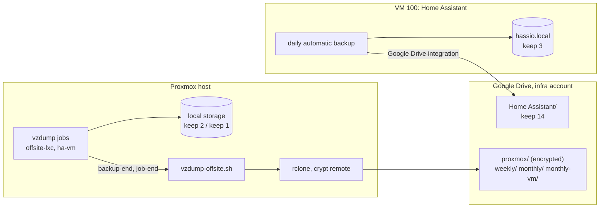

# Backups

What is backed up, where it goes, how long it is kept, and how to get it back.
Set up 2026-09-27. Every guest and the Home Assistant configuration have a copy
on the host **and** an encrypted copy on Google Drive, so neither a bad change
nor the loss of the host's only disk loses the home.

## What is kept where

| What | Where | When | Kept | Size (measured) |
| --- | --- | --- | --- | --- |
| Home Assistant full backup: config, add-ons, database, `media`, `share` | HA's own disk (`hassio.local`) | daily, HA's automatic backup | 3 | ~175 MB each |
| the same backup | Google Drive, folder `Home Assistant` | same run | 14 | ~175 MB each |
| LXC 101, 102, 103 dumps | host, storage `local` | weekly, Sun 03:30 (job `offsite-lxc`) | 2 per guest | 245–280 MB each |
| the same dumps + host config tarball | Drive `proxmox/weekly/` (encrypted) | after each weekly run | 29 days (4 runs) | ~790 MB per run |
| the same, first Sunday of the month | Drive `proxmox/monthly/` (encrypted) | copied in the same run | 93 days (3 runs) | ~790 MB per run |
| VM 100 (Home Assistant OS) dump | host, storage `local` | weekly, Sun 04:00 (job `ha-vm`) | 1 | 4.9 GB |
| the same, first Sunday of the month | Drive `proxmox/monthly-vm/` (encrypted) | copied in the same run | 1, replaced each month | 4.9 GB |

At steady state (after three months) Drive holds about **12.9 GB** of the
account's free 15 GB: HA 14 × 175 MB ≈ 2.4 GB, `weekly/` 4 × 790 MB ≈ 3.2 GB,
`monthly/` 3 × 790 MB ≈ 2.4 GB, `monthly-vm/` 4.9 GB. That is tight, and the
15 GB are shared with the account's Gmail and Photos. When it gets closer to
the limit, trim in this order: `monthly/` to 2 runs (−0.8 GB), HA on Drive to 10
copies (−0.7 GB), then drop `monthly-vm/` (the HA backups already cover
everything inside HA). Google One 100 GB removes the constraint.

**Retention really frees space on Drive.** Drive normally moves deleted files to
the Trash, where they keep counting against the quota for 30 days. HA's Drive
integration deletes permanently, and the rclone remote is configured with
`use_trash = false`, so both prunes delete for good (verified: a deleted test
file left nothing in the Trash).

**Not backed up:** the Proxmox host OS itself. vzdump can't image it and it
doesn't need to be imaged: a fresh Proxmox install plus the host config tarball
(below) rebuilds it.

## How it works



- **Home Assistant** uploads through its own *Google Drive* integration, which is
  set as a second location of the automatic backup. HA applies the retention per
  location (3 local, 14 on Drive). Both copies are encrypted with HA's backup
  encryption key.
- **Proxmox** runs two vzdump jobs (Datacenter → Backup). Both call the hook
  [`../tools/vzdump-offsite.sh`](../tools/vzdump-offsite.sh), installed as
  `/usr/local/bin/vzdump-offsite.sh`. At `backup-end` it notes each finished
  archive; at `job-end` it:
  1. for LXC runs: writes a host config tarball (`/etc/pve`, network, hosts,
     apt sources, `vzdump.conf`, the hook itself), copies the dumps (with their
     `.log` and `.notes`) and the tarball to `weekly/`, and on the month's first
     run (day 1–7) to `monthly/` as well; then deletes files older than 29 days
     from `weekly/` and older than 93 days from `monthly/`;
  2. for the VM run, only on the month's first run: copies the dump to
     `monthly-vm/`, then **lists the remote to confirm the new `.vma` is really
     there**, and only then deletes the previous month's copy, so there is
     always one complete copy. rclone's exit status alone is not proof: a
     `copy --include` that matches nothing uploads nothing and still exits 0.
- Any failed upload makes the hook exit non-zero, and **vzdump marks the whole
  job as failed**: it shows red in Datacenter → Backup and in the task log.
- Retention on Drive is by file age, so a run that fails doesn't delete
  anything extra; the next successful run catches up.

### The rclone remotes

`/root/.config/rclone/rclone.conf` on the host (root-only, never committed):

```ini
[gdrive]
type = drive
client_id = <Proxmox rclone client id>
client_secret = <its secret>
scope = drive.file
use_trash = false
token = <written by the OAuth sign-in>

[gdrive-crypt]
type = crypt
remote = gdrive:proxmox
filename_encryption = standard
directory_name_encryption = true
password = <rclone obscure of the crypt password>
password2 = <rclone obscure of the salt>
```

The host runs Debian's rclone 1.60. Its `rclone config update` starts a new
OAuth sign-in and waits for a browser forever; edit the file directly instead
(rclone rewrites only the `token` line when it refreshes).

## Credentials

| Secret | Lives in | Needed for |
| --- | --- | --- |
| Google account for the infrastructure | the household password manager (2-Step Verification on) | everything on Drive |
| Google Cloud project *HomeSweetHome Infra*, OAuth clients *Home Assistant Google Drive* (web) and *Proxmox rclone* (desktop), both limited to the `drive.file` scope | the infra account | re-linking HA or rclone |
| HA backup encryption key | HA (Settings → System → Backups) **and** the password manager | restoring any HA backup |
| rclone Drive token and the crypt password + salt | host `/root/.config/rclone/rclone.conf` (root-only) **and** the password manager | reading anything under `proxmox/` |

**Without the crypt password and salt, the Drive copies of the Proxmox backups
cannot be decrypted by anyone**, including us. They are not in this repository
and must never be.

The consent screen of *HomeSweetHome Infra* is **In production**. In *Testing*,
Google expires refresh tokens after 7 days, and both uploads would stop without
an error you'd notice.

## Restore

### An LXC, from the host

Datacenter → the node → `local` → Backups → pick the dump → **Restore**, or:

```sh
pct restore 101 /var/lib/vz/dump/vzdump-lxc-101-<date>.tar.zst --storage local-lvm --force
```

### An LXC, from Drive

On any Proxmox host with rclone configured with the same crypt password + salt:

```sh
rclone lsf gdrive-crypt:weekly/                  # or monthly/
rclone copy gdrive-crypt:weekly/ /var/lib/vz/dump/ --include "vzdump-lxc-101-<date>.*"
pct restore 101 /var/lib/vz/dump/vzdump-lxc-101-<date>.tar.zst --storage local-lvm
```

Test a restore on a spare ID (for example 901), start it, then remove it.

### Home Assistant, from Drive

1. Install a fresh Home Assistant OS VM (the community-scripts helper, as for
   VM 100, see [100-home-assistant.md](100-home-assistant.md)).
2. On the onboarding screen choose **Restore from backup**, upload the newest
   file from Drive's `Home Assistant` folder, and enter the backup encryption key.
3. Pass the Zigbee coordinator through again (USB) before starting Zigbee2MQTT.

Or restore the whole VM from `monthly-vm/` with `qmrestore`, which also brings
back the HAOS version and the disk layout; then restore the newest HA backup on
top of it, since that one is at most a day old.

### The host

1. Install Proxmox VE, same node name (`proxmox`).
2. Configure rclone again (Drive remote + `gdrive-crypt` with the saved password
   and salt), copy the newest `pve-host-config-*.tar.zst` from `weekly/`.
3. Restore from it what the new host is missing: `/etc/network/interfaces`, the
   storage and backup-job definitions in `/etc/pve/storage.cfg` and
   `/etc/pve/jobs.cfg`, `/usr/local/bin/vzdump-offsite.sh`. Don't copy the old
   `/etc/pve` over wholesale: it holds the old node's keys.
4. Restore the guests as above.

## Checks

- **HA:** Settings → System → Backups shows both locations and the last
  successful automatic backup; Drive's `Home Assistant` folder has at most 14.
- **Proxmox:** Datacenter → Backup shows the last run of each job; on the host,
  `rclone lsf -R gdrive-crypt:` lists the off-site files by their real names,
  and `rclone lsf -R gdrive:proxmox` only by encrypted ones.
- **Test the monthly paths** without waiting for the first Sunday: `touch
  /run/vzdump-offsite.force-monthly` on the host, then run the job (Datacenter →
  Backup → **Run now**). The hook removes the flag when it finishes.
- Keep an eye on free space on the host (`df -h /`): Proxmox never removes old
  kernels by itself (see [host.md](host.md#disk-space)).
