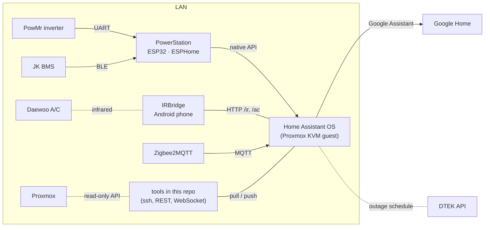

# HomeSweetHome

A working smart-home setup, kept in one repository: a Home Assistant
configuration mirrored into git, the firmware and apps that feed it, and the
tooling to change the live house through reviewable diffs.

Everything here runs in a real apartment, so it is written from practice rather
than as a template — but every module documents its setup, and every secret it
needs has a committed `*.example` counterpart.

## Modules

| Module | What it is |
| --- | --- |
| [`HomeAssistant/`](HomeAssistant/README.md) | The live Home Assistant `/config`, mirrored so config changes are reviewable diffs; custom Lovelace cards (inverter, battery, climate, outage schedule, load shedding, floor plan); the DTEK outage-schedule poller; battery-driven load shedding during outages; and SSH/REST/WebSocket tooling to pull, push and inspect the box. |
| [`PowerStation/`](PowerStation/README.md) | ESPHome firmware for an ESP32 that drives a PowMr hybrid inverter over UART and reads a JK BMS over BLE, with tariff- and grid-fault-aware power-priority logic, a night-tariff-only charging mode, and a pre-charge that fills the battery before a scheduled DTEK outage. |
| [`IRBridge/`](IRBridge/README.md) | Android app that turns an old phone's IR blaster into an authenticated HTTP API, so Home Assistant can drive a "dumb" split A/C — including a protocol sweep to find which IR codec the unit speaks. |
| [`FloorPlan/`](FloorPlan/README.md) | Tooling that renders a Sweet Home 3D model from above and turns it into the isometric **Home** dashboard, where each lamp lights its own room. |
| [`Proxmox/`](Proxmox/README.md) | The host and its guests, one doc each; read-only Proxmox API scripts that measure the Home Assistant guest's resource history; and the backup setup that keeps every guest and HA's backups on the host and, encrypted, on Google Drive ([`Proxmox/docs/backups.md`](Proxmox/docs/backups.md)). |

**This is the `metercam` branch**: `master` plus the MeterCam project, which
feeds the Energy dashboard's gas tab and is not merged into `master` yet:

| Module | What it is |
| --- | --- |
| [`MeterCam/`](MeterCam/README.md) | An ESP32-CAM that wakes every 30 minutes to photograph the gas meter's dial, and a service in a Proxmox LXC that reads the digits and hands Home Assistant a reading only when it can stand behind it. |

Unfinished projects live on branches of their own until they are:

- [`metercam`](../../tree/metercam): **MeterCam**, a camera that reads the gas
  meter's dial for Home Assistant.
- [`ledlamp`](../../tree/ledlamp): **LedLamp**, a ceiling lamp rebuilt as a Zigbee
  tunable-white COB light, with its parts list, wiring and a printable guide.

## Getting started

Each module is self-contained; start from its README. The common prerequisites:

- **Home Assistant OS** with the Terminal & SSH add-on, reachable over SSH as the
  alias `ha` (see [HomeAssistant → Access](HomeAssistant/README.md#access-once)).
- **Python 3.11+**, `sh`, `ssh` and `tar` for the tooling (`pip install -r
  HomeAssistant/tools/requirements.txt`).
- **Docker** for building the ESPHome firmware; **JDK 17+ and the Android SDK** for the
  IRBridge app.

## Secrets and private files

Nothing secret is committed. Each real file below is git-ignored and has an
example next to it (or in [`HomeAssistant/examples/`](HomeAssistant/examples)):

| Real file (never committed) | Template | Holds |
| --- | --- | --- |
| `HomeAssistant/secrets.env` | `HomeAssistant/secrets.env.example` | HA URL and long-lived token for the tools |
| HA box `/config/secrets.yaml` | `HomeAssistant/examples/secrets.yaml.example` | IRBridge token and URLs, DTEK address |
| HA box `/config/google_key.json` | — (a Google Cloud service-account key) | Google Assistant credentials |
| `HomeAssistant/config/google_assistant.yaml` | `HomeAssistant/examples/google_assistant.example.yaml` | Google Home names and aliases in the household's language |
| `HomeAssistant/config/packages/household_notify.yaml` | `HomeAssistant/examples/household_notify.example.yaml` | the phones behind `notify.household` |
| `PowerStation/secrets.yaml` | `PowerStation/secrets.yaml.example` | Wi-Fi, API key, OTA password, BMS MAC |
| `Proxmox/secrets.env` | `Proxmox/secrets.env.example` | read-only Proxmox API token |
| `IRBridge/local.properties` | `IRBridge/local.properties.example` | Android SDK path |
| Proxmox host `/root/.config/rclone/rclone.conf` | — (see [`Proxmox/docs/backups.md`](Proxmox/docs/backups.md#credentials)) | Google Drive token and the crypt password for the off-site backups |

See [SECURITY.md](SECURITY.md) for how this is enforced and how to report a leak.

## Rules

How the repository is organised — the layout every project follows, where
documentation goes, the English-only and secrets rules, versioning and the git
workflow — is written down in [MANIFEST.md](MANIFEST.md). Read it before adding
a project or a document.

## License

[MIT](LICENSE). The bundled web fonts are under the SIL Open Font License 1.1
([`HomeAssistant/config/www/fonts/OFL.txt`](HomeAssistant/config/www/fonts/OFL.txt)).
